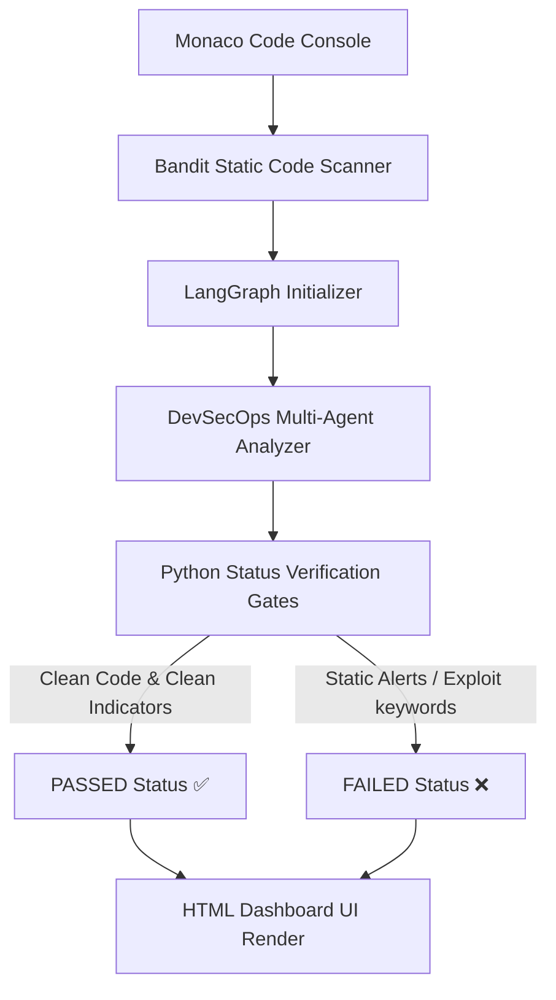

# CodeGuardian AI — Enterprise Code Audit & DevSecOps Platform

CodeGuardian AI is an autonomous, agentic code auditing and review platform. Powered by LangGraph, FastAPI, and Monaco Editor, it runs real-time security scans, detects code quality flaws, generates pytest unit tests, verifies docstring conventions, and proposes one-click automated patches directly back into your source files.

---

## 🚀 Key Features

* **Real-time Monaco Editor Console:** Write, modify, and review Python scripts directly in a premium dark-themed VS-Code styled browser editor.
* **Deterministic LangGraph Pipeline:** Combines specialized AppSec and Quality reviewer agents sequentially into a high-performance analyzer pipeline.
* **4-Category DevSecOps Auditing:**
  * **🛡️ Security Audit:** Explains verified high-severity vulnerabilities (SQL Injection, secrets leaks, pickle RCE) or confirms code safety.
  * **🔍 Code Quality:** Suggests modular refactoring, naming conventions, and flags potential deadlocks or file handle leaks.
  * **🧪 Unit Tests:** Generates complete standard starter unit test suites using the `pytest` framework.
  * **📝 Docs Audit:** Scans for missing public method docstrings and argument logs.
* **Automated Patch Apply:** Highlights proposed refactoring changes in visual Git diff cards and lets you apply the fix in a single click.
* **Aggressive Rate-Limit Mitigation:** Optimized single-node token bundling ensuring full compatibility with Groq's 6,000 TPM limit (saving over 4x on tokens).
* **CI/CD Integration Gatekeeper:** Simulated webhook pipeline accepting Pull Request triggers and automating security review checks.

---

## 🛠️ Architectural Workflow

The following flowchart describes the pipeline flow from the user console input down to the status verification gates:



---

## 📦 Installation & Setup

### 1. Clone the Repository
```bash
git clone https://github.com/Akshat-124/code-guardian-AI.git
cd code-guardian-AI
```

### 2. Configure Environment Variables
Create a `.env` file in the root directory:
```env
GROQ_API_KEY=your_groq_api_key_here
PORT=8000
HOST=127.0.0.1
```

### 3. Install Dependencies
```bash
pip install -r requirements.txt
```

### 4. Run the DevSecOps Server
```bash
python run.py
```
Open [http://127.0.0.1:8000](http://127.0.0.1:8000) in your web browser.

---

## 🧪 Testing the Platform via Interactive Dashboard

* Load `http://127.0.0.1:8000/` in your browser.
* Specify the file metadata (e.g. `math_utils.py`) in the top-left path input box.
* Paste your target script in Monaco Editor, then click **Execute Pipeline**.

### A. Secure Code Test (Expect `PASSED ✅`)
Copy and paste this clean factorial function:
```python
def calculate_factorial(n: int) -> int:
    """
    Safely calculates the factorial of a non-negative integer.
    """
    if n < 0:
        raise ValueError("Factorial is not defined for negative integers.")
    if n == 0 or n == 1:
        return 1
        
    result = 1
    for i in range(2, n + 1):
        result *= i
    return result
```

### B. Vulnerable Code Test (Expect `FAILED ❌`)
Copy and paste this script containing SQL and Command Injection vulnerabilities:
```python
import sqlite3
import subprocess

def unsafe_login(username: str, system_cmd: str) -> None:
    conn = sqlite3.connect("users.db")
    cursor = conn.cursor()
    # SQL Injection
    query = f"SELECT * FROM accounts WHERE name = '{username}'"
    cursor.execute(query)
    
    # RCE
    subprocess.Popen(f"ping {system_cmd}", shell=True)
```

---

## 🛡️ CI/CD Integration: GitHub Webhook PR Scanner

Expose your local port and receive real-time webhook payloads from GitHub when Pull Requests are opened or modified.

### 1. Set Up ngrok Tunnel
1. Sign up on [ngrok.com](https://ngrok.com/) and download the utility.
2. Authenticate your CLI session:
   ```bash
   ngrok config add-authtoken <YOUR_TOKEN>
   ```
3. Expose port 8000 to the public web:
   ```bash
   ngrok http 8000
   ```
4. Copy the generated forwarding HTTPS URL: `https://<ngrok-id>.ngrok-free.app`.

### 2. Configure GitHub Repository Webhook
1. Go to your GitHub repository Settings ➡️ **Webhooks** ➡️ **Add webhook**.
2. **Payload URL:** Paste your ngrok URL and append `/webhook/github` (e.g. `https://<ngrok-id>.ngrok-free.app/webhook/github`).
3. **Content type:** Select `application/json`.
4. **Which events to trigger:** Select *"Let me select individual events"* and check **ONLY** `Pull requests` (uncheck `Pushes`).
5. Click **Add webhook**. A green checkmark confirms GitHub successfully pinged your local FastAPI server.

### 3. Run Simulated Webhook Audit
Validate PR annotations on multi-file changes directly in your CLI using the test harness:
```bash
python tests/simulate_github_webhook.py
```
